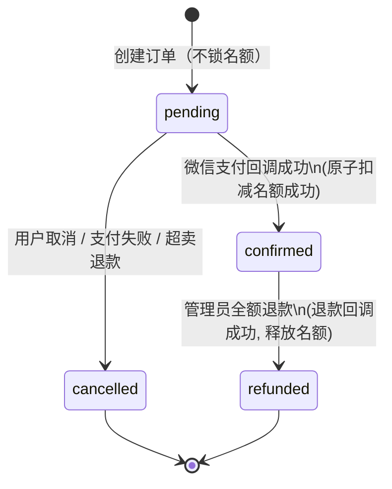

# Phase 1 — Data Model

**Feature**: 旅游游学项目报名小程序平台 · **Storage**: MySQL 8.0 (utf8mb4) · **ORM**: TypeORM
**Date**: 2026-07-13 · 对应 spec [spec.md](./spec.md) 的 Key Entities

> 字段类型按 MySQL 给出；TypeORM 实体一一对应（`@Entity`/`@Column`/`@Index`）。时间统一 `DATETIME(3)`；金额 `DECIMAL(10,2)`（元）；主键 `BIGINT UNSIGNED AUTO_INCREMENT`。证件号/手机号 **明文存储**（spec 澄清 Q1，用户接受 v1 合规风险）。

---

## 实体关系概览

```text
admins 1───N projects
users  1───N orders N───1 projects
orders 1───1 participants
users  1───N consent_records
admins/system ──N audit_logs
```

- `users` 1—N `orders`（一个用户多条报名）
- `projects` 1—N `orders`（一个项目多条报名订单）
- `orders` 1—1 `participants`（单人/订单，参团人可与报名用户不同）
- `admins` 1—N `projects`（创建人）
- `audit_logs` 记录管理员/系统对项目与订单的关键操作

---

## E1. users（用户）

| 字段 | 类型 | 约束 | 说明 |
|---|---|---|---|
| id | BIGINT UNSIGNED | PK, AI | |
| openid | VARCHAR(64) | NOT NULL, UNIQUE | 微信 openid（登录主标识） |
| unionid | VARCHAR(64) | NULL | 开放平台 unionid（如有） |
| nickname | VARCHAR(64) | NULL | 微信昵称 |
| avatar_url | VARCHAR(512) | NULL | 头像 |
| phone | VARCHAR(20) | NULL | 授权手机号 |
| created_at | DATETIME(3) | NOT NULL | |
| updated_at | DATETIME(3) | NOT NULL | |

**校验/规则**: openid 唯一；首次登录时 upsert 创建。

## E2. admins（管理员）

| 字段 | 类型 | 约束 | 说明 |
|---|---|---|---|
| id | BIGINT UNSIGNED | PK, AI | |
| username | VARCHAR(64) | NOT NULL, UNIQUE | 登录账号 |
| password_hash | VARCHAR(255) | NOT NULL | bcrypt |
| display_name | VARCHAR(64) | NULL | 显示名 |
| status | TINYINT | NOT NULL DEFAULT 1 | 1=启用, 0=禁用 |
| created_at / updated_at | DATETIME(3) | NOT NULL | |

**初始化**: 种子脚本注入首个管理员（见 research.md D15）。

## E3. projects（游学项目）

| 字段 | 类型 | 约束 | 说明 |
|---|---|---|---|
| id | BIGINT UNSIGNED | PK, AI | |
| title | VARCHAR(128) | NOT NULL | 标题 |
| cover_image_url | VARCHAR(512) | NULL | 封面图 URL |
| description | TEXT | NULL | 图文介绍（富文本） |
| itinerary | TEXT | NULL | 行程安排 |
| departure_date | DATE | NULL | 出发日期 |
| return_date | DATE | NULL | 返回日期 |
| price | DECIMAL(10,2) | NOT NULL | 价格（元） |
| total_quota | INT UNSIGNED | NOT NULL | 总名额 |
| registered_count | INT UNSIGNED | NOT NULL DEFAULT 0 | 已报名人数（支付成功才 +1） |
| enroll_deadline | DATETIME(3) | NULL | 报名截止时间 |
| status | VARCHAR(16) | NOT NULL DEFAULT 'draft' | draft/published/offline |
| created_by_admin_id | BIGINT UNSIGNED | FK→admins | 创建人 |
| created_at / updated_at | DATETIME(3) | NOT NULL | |
| deleted_at | DATETIME(3) | NULL | 软删除（FR-102） |

**校验/规则**: 仅 `published` 且 `NOW() <= enroll_deadline` 且 `registered_count < total_quota` 时允许新报名（FR-005）。`registered_count` 只能由支付成功的原子扣减语句改变（见下「名额」）。

## E4. participants（参团人，固定字段集）

| 字段 | 类型 | 约束 | 说明 |
|---|---|---|---|
| id | BIGINT UNSIGNED | PK, AI | |
| order_id | BIGINT UNSIGNED | NOT NULL, FK→orders, UNIQUE | 一对一 |
| name | VARCHAR(64) | NOT NULL | 姓名 |
| id_card_type | VARCHAR(16) | NOT NULL | 身份证/护照/户口本/其他 |
| id_card | VARCHAR(64) | NOT NULL | 证件号 |
| phone | VARCHAR(20) | NULL | 联系电话 |
| relation | VARCHAR(32) | NULL | 与报名人关系 |
| emergency_name | VARCHAR(64) | NULL | 紧急联系人 |
| emergency_phone | VARCHAR(20) | NULL | 紧急联系人电话 |
| school_grade | VARCHAR(128) | NULL | 就读学校/年级 |
| remark | VARCHAR(255) | NULL | 备注 |
| created_at | DATETIME(3) | NOT NULL | |

**校验**: 证件号按 `id_card_type` 正则校验（class-validator）；`order_id` UNIQUE 保证一单一参团人。

## E5. orders（报名订单）

| 字段 | 类型 | 约束 | 说明 |
|---|---|---|---|
| id | BIGINT UNSIGNED | PK, AI | |
| order_no | VARCHAR(32) | NOT NULL, UNIQUE | 业务订单号 |
| project_id | BIGINT UNSIGNED | NOT NULL, FK→projects | |
| user_id | BIGINT UNSIGNED | NOT NULL, FK→users | 报名用户（付款人） |
| participant_id | BIGINT UNSIGNED | NOT NULL, FK→participants, UNIQUE | 参团人 |
| participant_id_card | VARCHAR(64) | NOT NULL | 冗余证件号（用于唯一约束，创建时从参团人复制） |
| amount | DECIMAL(10,2) | NOT NULL | 下单时锁定价格 |
| status | VARCHAR(16) | NOT NULL DEFAULT 'pending' | pending/confirmed/refunded/cancelled |
| paid_at | DATETIME(3) | NULL | 支付成功时间 |
| transaction_id | VARCHAR(64) | NULL | 微信支付交易号 |
| refund_amount | DECIMAL(10,2) | NULL | v1=amount（全额） |
| refund_transaction_id | VARCHAR(64) | NULL | 微信退款单号 |
| refund_status | VARCHAR(16) | NULL | pending/processing/success/failed |
| refunded_at | DATETIME(3) | NULL | 退款成功时间 |
| cancelled_at | DATETIME(3) | NULL | 取消时间 |
| active_key | VARCHAR(140) | GENERATED, STORED | 见下「唯一性」 |
| created_at / updated_at | DATETIME(3) | NOT NULL | |

**关键索引**:
- `UNIQUE uk_orders_active_key (active_key)` — 保证同项目同证件号仅一条有效订单
- `KEY idx_orders_user (user_id, status)` — 「我的订单」查询
- `KEY idx_orders_project (project_id, status)` — 后台按项目筛选
- `KEY idx_orders_phone (participant_id)` 不便按手机号；手机号筛选用 join participant，或冗余 `participant_phone`（可选优化）

> 说明：`participant_id_card` 为有意冗余（从参团人复制），因 MySQL 生成列不能跨表引用；这是实现「条件唯一」的必要折中。

## E6. consent_records（授权同意记录）

| 字段 | 类型 | 约束 | 说明 |
|---|---|---|---|
| id | BIGINT UNSIGNED | PK, AI | |
| user_id | BIGINT UNSIGNED | NOT NULL, FK→users | |
| consent_type | VARCHAR(32) | NOT NULL | sensitive_info_collection |
| policy_version | VARCHAR(16) | NOT NULL | 隐私协议版本 |
| consented_at | DATETIME(3) | NOT NULL | |

## E7. audit_logs（操作日志）

| 字段 | 类型 | 约束 | 说明 |
|---|---|---|---|
| id | BIGINT UNSIGNED | PK, AI | |
| actor_type | VARCHAR(16) | NOT NULL | admin/system |
| actor_id | BIGINT UNSIGNED | NULL | |
| action | VARCHAR(64) | NOT NULL | 如 `order.refund`、`project.publish` |
| target_type | VARCHAR(32) | NULL | project/order |
| target_id | BIGINT UNSIGNED | NULL | |
| amount | DECIMAL(10,2) | NULL | 涉及金额时记录 |
| meta | JSON | NULL | 附加上下文 |
| created_at | DATETIME(3) | NOT NULL | |

---

## 订单状态机（FR + 澄清对齐）



**迁移规则**:
- `pending → confirmed`：仅由支付 `notify` 触发；执行名额原子扣减（受影响行=1 才迁移），否则转 `cancelled` 并退款。
- `pending → cancelled`：用户主动取消、支付失败、或抢名额失败；释放「待支付」不涉及名额（无需回补）。
- `confirmed → refunded`：仅全额退款；退款 `notify` 成功后 `registered_count - 1`（幂等：已 refunded 则跳过）。
- `refunded`/`cancelled` 为终态。

---

## 名额并发控制（spec 策略 A，见 research.md D9）

**创建订单（pending，不扣名额）**：事务内先做唯一性检查（应用层）+ 生成列兜底；再 INSERT order。

**支付成功回调（原子扣减名额）**：
```sql
START TRANSACTION;
UPDATE projects
   SET registered_count = registered_count + 1
 WHERE id = :projectId AND registered_count < total_quota;
-- affected_rows = 1  → 订单置 confirmed、写 paid_at/transaction_id
-- affected_rows = 0  → 名额已被抢完 → 订单置 cancelled 并立即发起全额退款
COMMIT;
```
受影响行数决定迁移路径；超卖率 = 0（SC-003）。退款触发后由退款回调闭环。

---

## 唯一性约束（同项目同证件号仅一条有效订单，FR-015 / research.md D10）

```sql
active_key VARCHAR(140) GENERATED ALWAYS AS (
  CASE WHEN status IN ('pending','confirmed')
       THEN CONCAT(project_id, ':', participant_id_card)
       ELSE NULL END
) STORED,
UNIQUE KEY uk_orders_active_key (active_key)
```
- MySQL 唯一索引**忽略 NULL** → 历史 `cancelled`/`refunded` 订单（active_key=NULL）不冲突，允许同证件号重新报名（在先前订单已取消/退款后）。
- 应用层在下单事务内先 `SELECT` 现存有效订单返回友好提示「该参团人已报名」；DB 唯一索引作为并发兜底。

---

## 完整 DDL 草案（MySQL 8.0）

```sql
SET NAMES utf8mb4;

CREATE TABLE users (
  id          BIGINT UNSIGNED NOT NULL AUTO_INCREMENT,
  openid      VARCHAR(64)  NOT NULL,
  unionid     VARCHAR(64)  NULL,
  nickname    VARCHAR(64)  NULL,
  avatar_url  VARCHAR(512) NULL,
  phone       VARCHAR(20)  NULL,
  created_at  DATETIME(3)  NOT NULL,
  updated_at  DATETIME(3)  NOT NULL,
  PRIMARY KEY (id),
  UNIQUE KEY uk_users_openid (openid)
) ENGINE=InnoDB DEFAULT CHARSET=utf8mb4;

CREATE TABLE admins (
  id             BIGINT UNSIGNED NOT NULL AUTO_INCREMENT,
  username       VARCHAR(64)  NOT NULL,
  password_hash  VARCHAR(255) NOT NULL,
  display_name   VARCHAR(64)  NULL,
  status         TINYINT      NOT NULL DEFAULT 1,
  created_at     DATETIME(3)  NOT NULL,
  updated_at     DATETIME(3)  NOT NULL,
  PRIMARY KEY (id),
  UNIQUE KEY uk_admins_username (username)
) ENGINE=InnoDB DEFAULT CHARSET=utf8mb4;

CREATE TABLE projects (
  id                  BIGINT UNSIGNED NOT NULL AUTO_INCREMENT,
  title               VARCHAR(128)  NOT NULL,
  cover_image_url     VARCHAR(512)  NULL,
  description         TEXT          NULL,
  itinerary           TEXT          NULL,
  departure_date      DATE          NULL,
  return_date         DATE          NULL,
  price               DECIMAL(10,2) NOT NULL,
  total_quota         INT UNSIGNED  NOT NULL,
  registered_count    INT UNSIGNED  NOT NULL DEFAULT 0,
  enroll_deadline     DATETIME(3)   NULL,
  status              VARCHAR(16)   NOT NULL DEFAULT 'draft',
  created_by_admin_id BIGINT UNSIGNED NULL,
  created_at          DATETIME(3)   NOT NULL,
  updated_at          DATETIME(3)   NOT NULL,
  deleted_at          DATETIME(3)   NULL,
  PRIMARY KEY (id),
  KEY idx_projects_status (status, enroll_deadline),
  KEY idx_projects_created_by (created_by_admin_id),
  CONSTRAINT fk_projects_admin FOREIGN KEY (created_by_admin_id) REFERENCES admins(id)
) ENGINE=InnoDB DEFAULT CHARSET=utf8mb4;

CREATE TABLE orders (
  id                     BIGINT UNSIGNED NOT NULL AUTO_INCREMENT,
  order_no               VARCHAR(32)   NOT NULL,
  project_id             BIGINT UNSIGNED NOT NULL,
  user_id                BIGINT UNSIGNED NOT NULL,
  participant_id         BIGINT UNSIGNED NOT NULL,
  participant_id_card    VARCHAR(64)   NOT NULL,
  amount                 DECIMAL(10,2) NOT NULL,
  status                 VARCHAR(16)   NOT NULL DEFAULT 'pending',
  paid_at                DATETIME(3)   NULL,
  transaction_id         VARCHAR(64)   NULL,
  refund_amount          DECIMAL(10,2) NULL,
  refund_transaction_id  VARCHAR(64)   NULL,
  refund_status          VARCHAR(16)   NULL,
  refunded_at            DATETIME(3)   NULL,
  cancelled_at           DATETIME(3)   NULL,
  active_key VARCHAR(140) GENERATED ALWAYS AS (
    CASE WHEN status IN ('pending','confirmed')
         THEN CONCAT(project_id, ':', participant_id_card) ELSE NULL END
  ) STORED,
  created_at             DATETIME(3)   NOT NULL,
  updated_at             DATETIME(3)   NOT NULL,
  PRIMARY KEY (id),
  UNIQUE KEY uk_orders_order_no (order_no),
  UNIQUE KEY uk_orders_participant (participant_id),
  UNIQUE KEY uk_orders_active_key (active_key),
  KEY idx_orders_user (user_id, status),
  KEY idx_orders_project (project_id, status),
  CONSTRAINT fk_orders_project FOREIGN KEY (project_id) REFERENCES projects(id),
  CONSTRAINT fk_orders_user    FOREIGN KEY (user_id)    REFERENCES users(id)
) ENGINE=InnoDB DEFAULT CHARSET=utf8mb4;

CREATE TABLE participants (
  id              BIGINT UNSIGNED NOT NULL AUTO_INCREMENT,
  order_id        BIGINT UNSIGNED NOT NULL,
  name            VARCHAR(64)  NOT NULL,
  id_card_type    VARCHAR(16)  NOT NULL,
  id_card         VARCHAR(64)  NOT NULL,
  phone           VARCHAR(20)  NULL,
  relation        VARCHAR(32)  NULL,
  emergency_name  VARCHAR(64)  NULL,
  emergency_phone VARCHAR(20)  NULL,
  school_grade    VARCHAR(128) NULL,
  remark          VARCHAR(255) NULL,
  created_at      DATETIME(3)  NOT NULL,
  PRIMARY KEY (id),
  UNIQUE KEY uk_participants_order (order_id),
  CONSTRAINT fk_participants_order FOREIGN KEY (order_id) REFERENCES orders(id)
) ENGINE=InnoDB DEFAULT CHARSET=utf8mb4;

CREATE TABLE consent_records (
  id             BIGINT UNSIGNED NOT NULL AUTO_INCREMENT,
  user_id        BIGINT UNSIGNED NOT NULL,
  consent_type   VARCHAR(32) NOT NULL,
  policy_version VARCHAR(16) NOT NULL,
  consented_at   DATETIME(3) NOT NULL,
  PRIMARY KEY (id),
  KEY idx_consent_user (user_id, consent_type),
  CONSTRAINT fk_consent_user FOREIGN KEY (user_id) REFERENCES users(id)
) ENGINE=InnoDB DEFAULT CHARSET=utf8mb4;

CREATE TABLE audit_logs (
  id          BIGINT UNSIGNED NOT NULL AUTO_INCREMENT,
  actor_type  VARCHAR(16)   NOT NULL,
  actor_id    BIGINT UNSIGNED NULL,
  action      VARCHAR(64)   NOT NULL,
  target_type VARCHAR(32)   NULL,
  target_id   BIGINT UNSIGNED NULL,
  amount      DECIMAL(10,2) NULL,
  meta        JSON          NULL,
  created_at  DATETIME(3)   NOT NULL,
  PRIMARY KEY (id),
  KEY idx_audit_target (target_type, target_id),
  KEY idx_audit_actor (actor_type, actor_id)
) ENGINE=InnoDB DEFAULT CHARSET=utf8mb4;
```

> 实施时由 TypeORM 迁移（`typeorm migration:generate`）承载，DDL 仅作设计参照与评审用。`participants` 与 `orders` 的循环外键（order↔participant）在迁移中以先建表后加外键或单向外键处理，避免循环依赖。
